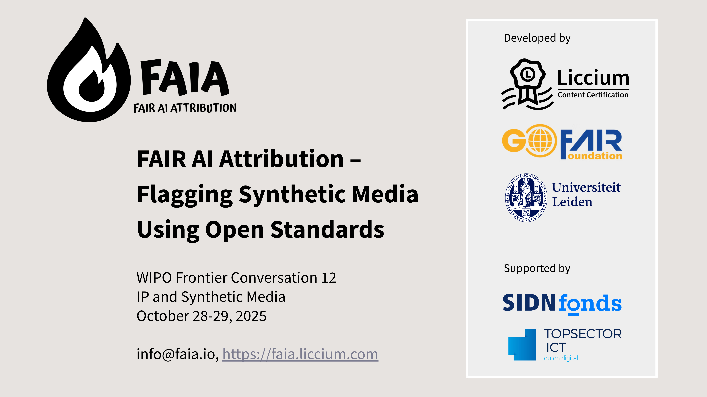
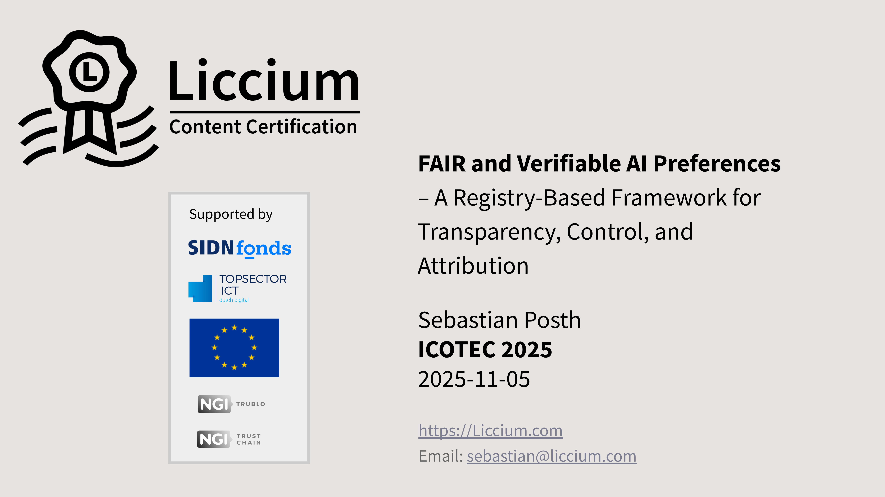

# Presentations

## **October 2025**

**FAIR AI Attribution – Flagging Synthetic Media Using Open Standards**\
WIPO Frontier Conversation 12 – IP and Synthetic Media\
October 28-29, 2025

<figure><figcaption></figcaption></figure>

Video Recording of the presentation: \
[https://webcast.wipo.int/video/WIPO\_IP\_CONV\_GE\_2\_2025-10-29\_PM\_126034?startTime=9552](https://webcast.wipo.int/video/WIPO_IP_CONV_GE_2_2025-10-29_PM_126034?startTime=9552)

## November 2025

**A Fair and Verifiable AI Preference System – A Registry-Based Framework for Transparency, Control, and Provenance**\
November 05, 2025, Seoul, Korea, ICOTEC, [https://www.icotec.or.kr/conference](https://www.icotec.or.kr/conference)

<figure><figcaption></figcaption></figure>

