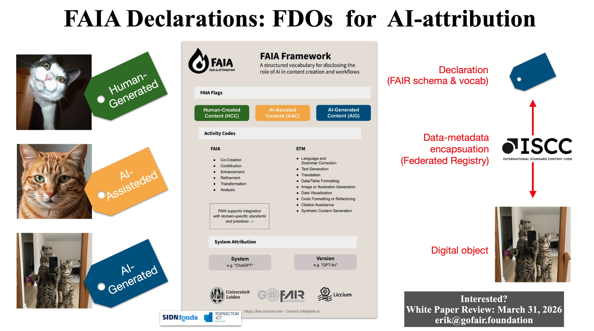
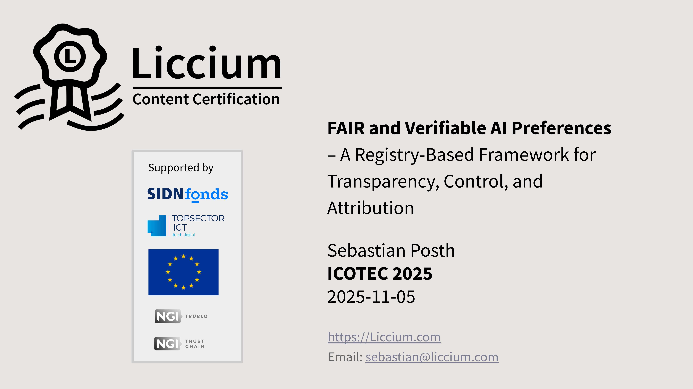
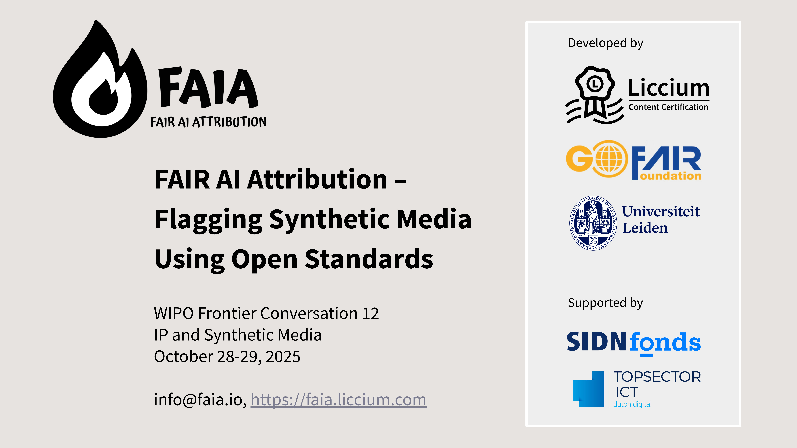

# Presentations

## Download the FAIA 1-pager


FAIA 1-pager


## March 2026

FDO Forum Conference, TU Vienna, March 27 2026, [https://fairdo.org/fdo-conference-2026-full-program/](https://fairdo.org/fdo-conference-2026-full-program/)

<figure><figcaption></figcaption></figure>

## November 2025

**A Fair and Verifiable AI Preference System – A Registry-Based Framework for Transparency, Control, and Provenance**\
November 05, 2025, Seoul, Korea, ICOTEC, [https://www.icotec.or.kr/conference](https://www.icotec.or.kr/conference)

<figure><figcaption></figcaption></figure>

## **October 2025**

**FAIR AI Attribution – Flagging Synthetic Media Using Open Standards**\
WIPO Frontier Conversation 12 – IP and Synthetic Media\
October 28-29, 2025

<figure><figcaption></figcaption></figure>

Video Recording of the presentation: \
[https://webcast.wipo.int/video/WIPO\_IP\_CONV\_GE\_2\_2025-10-29\_PM\_126034?startTime=9552](https://webcast.wipo.int/video/WIPO_IP_CONV_GE_2_2025-10-29_PM_126034?startTime=9552)

## September 2025

**Kick-off Event, Responsible AI in de praktijk**\
September 24, 2025, Utrecht

<figure><figcaption></figcaption></figure>

## The FAIA Pitch


Video Pitch


This short video introduces the FAIA initiative. It highlights the problem of AI opacity, emerging regulation like the EU AI Act, and a practical solution for certifying content with verifiable AI involvement.
