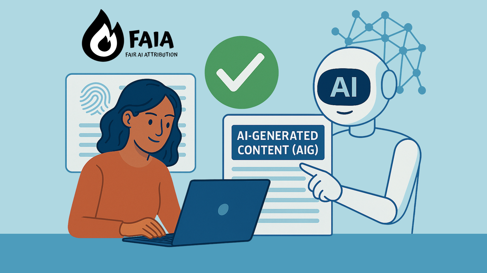
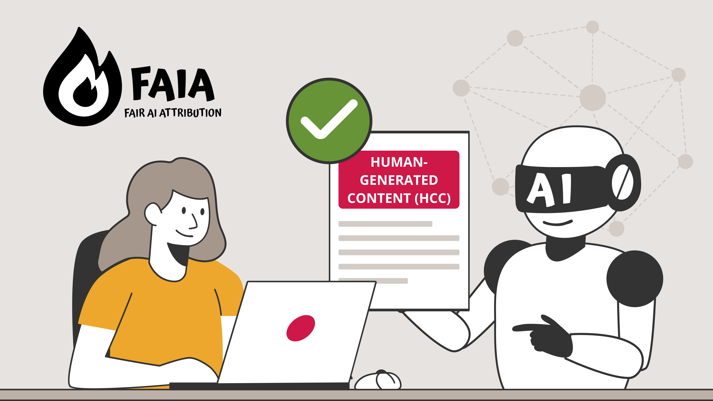

# Examples

## Explore how FAIA flags are applied in practice.

Below are real examples of how creators use the FAIA framework to disclose whether content was created by humans or generated by AI. Each example is linked to a verifiable declaration on the Liccium platform.

<figure><figcaption>
AI-Generated Content (AIG) – <a href="https://liccium.app/dec-id/syxsif9mm7cs74uznlcx">https://liccium.app/dec-id/syxsif9mm7cs74uznlcx</a> 
</figcaption></figure>

<figure><figcaption>
Human-Created Content (HCC) – <a href="https://liccium.app/dec-id/syxsdmtbuhnpavi9pyt1">https://liccium.app/dec-id/syxsdmtbuhnpavi9pyt1</a>
</figcaption></figure>

Watch the FAIA explainer video to understand how users or platforms can detect. resolve, and verify the provenance and AI disclosure:&#x20;



