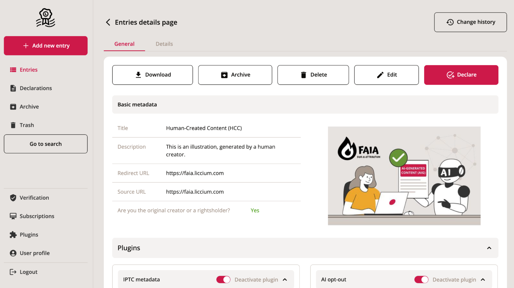

# Implementation

## The Liccium Platform

The FAIA attribution framework is integrated into the [**Liccium platform**](https://liccium.com/) as a plugin. This enables creators, researchers, publishers, and platforms to declare AI involvement directly within their content authentication workflows. Designed to be intuitive yet technically robust, the plugin supports transparency, compliance, and interoperability by making AI contributions to content creation verifiable and persistently linked to the original work.

<figure><figcaption>
Liccium application
</figcaption></figure>

## How does it work?

### **1. Select the Type of AI Involvement**

Users can choose from a set of standardised **Flags** that reflect the degree and nature of AI’s contribution. These include the following categories:

<table><thead><tr><th width="139.49609375" align="center">Flag</th><th width="196.65625">Name</th><th>Description</th></tr></thead><tbody><tr><td align="center">HCC</td><td>Human-Created Content</td><td>Content created and edited exclusively by humans. While digital tools may be used, no AI systems are involved at any stage of the creative or editorial process.</td></tr><tr><td align="center">AAC</td><td>AI-Assisted Content</td><td>Content where a human remains the primary author but AI systems contributed during the process. This may include suggestions, generation of fragments, or refinement steps performed under human supervision and editorial control.</td></tr><tr><td align="center">AIG</td><td>AI-Generated Content</td><td>Content generated predominantly or entirely by an AI system. The AI is the main creative agent. Human input may be limited to initiating a prompt or selecting from outputs, with minimal or no human editing or authorship applied.</td></tr></tbody></table>

These flags provide high-level signals of AI involvement. It is intended for use in content metadata, declarations, digital packaging, or registry records.

_<mark style="color:red;">Be aware that the framework is still in development!</mark>_&#x20;

### **2. Provide Contextual Metadata**

To increase transparency and support downstream processing, FAIA supports additional metadata describing **what was done**, **who did it**, and **how**:

#### **a. Activity Type**

Specifies the operation performed on or to the content. FAIA supports activity codes from:

* **IPTC** (for image-related workflows)
* **STM** (for publishing workflows)
* **FAIA** (generic cross-media activity types such as `faia:Contribution`, `faia:Enhancement`, or `faia:Generation`)

#### **b. System Metadata (only if the actor is AI)**

If the activity was performed by an AI system, the following fields may be included to support reproducibility and audit:

* **Tool** – Name of the system or interface (e.g. `"ChatGPT"`)
* **Model** – Underlying model (e.g. `"GPT-4o"`)
* **Version** – Model or tool version (e.g. `"4.0"`)
* **Provider** – The organization offering the AI system (e.g. `"OpenAI"`)

_<mark style="color:red;">Be aware that the framework is still in development!</mark>_&#x20;

### **3. Bind to the ISCC Code**

All FAIA declarations are **cryptographically bound** to the **International Standard Content Code (ISCC)**, a content-derived identifier and ISO standard (ISO 24138). This ensures that attribution metadata remains uniquely and persistently associated with the content – even if the asset is modified and redistributed.

### **4. Generate Verifiable, Timestamped Declarations**

Every declaration is digitally signed using  **Verifiable Credential (VC)** or **DID keys** of the creator. The declaration is stored as a tamper-evident **JSON-LD file (nanopublication)**, including a trusted timestamp. This guarantees the authenticity and integrity of the AI attribution data.

### **5. Register in the Liccium Registry**

The declarations are published to a **public, decentralised registry** operated by Liccium, making them:

* **Publicly resolvable** using content identifiers like the ISCC
* **Searchable** for researchers, platforms, and compliance tools
* **Auditable** under regulatory regimes such as the EU AI Act (e.g. Article 50 disclosure obligations)

This registry ensures lasting transparency and verifiability in content attribution and provenance.
