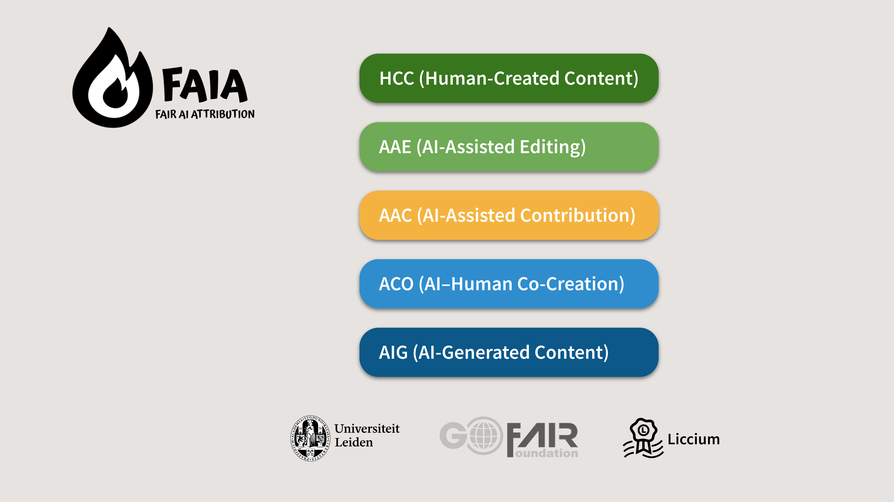

---
layout:
  title:
    visible: true
  description:
    visible: false
  tableOfContents:
    visible: true
  outline:
    visible: true
  pagination:
    visible: true
---

# Vocabulary

## Attribution Flags

At the heart of the FAIA framework is a controlled vocabulary designed to transparently and consistently disclose the role of AI in the content creation process. This vocabulary introduces standardised **Attribution Flags** that classify content based on how and to what extent AI was involved.&#x20;

<figure><figcaption></figcaption></figure>

## FAIA Core Flag Set (_work in progress_)

<table><thead><tr><th width="87.62890625" align="center">Flage Code</th><th width="196.65625">Name</th><th>Description</th></tr></thead><tbody><tr><td align="center">HCC</td><td>Human-Created Content</td><td>Content created and edited entirely by humans. May involve digital tools, but no AI involvement at any stage.</td></tr><tr><td align="center">AAE</td><td>AI-Assisted Editing</td><td>AI is used only after initial creation—for grammar, formatting, cleanup, upscaling, or similar editorial improvements. No AI-generated content added.</td></tr><tr><td align="center">AAC</td><td>AI-Assisted Contribution</td><td>AI contributes during the creation process, such as suggesting content, generating fragments, or shaping drafts, under human direction and control.</td></tr><tr><td align="center">ACO</td><td>AI–Human Co-Creation</td><td>AI and human share creative responsibility. Content results from iterative collaboration or joint authorship between human and AI.</td></tr><tr><td align="center">AIG</td><td>AI-Generated Content</td><td>AI is the primary creator. Human input is limited to initiating or curating. Little to no human editing or creative direction is applied post-output.</td></tr></tbody></table>

This general-purpose taxonomy applies across media types – text, images, audio, and video – and forms the foundation for verifiable content declarations in the Liccium ecosystem.

## **Alignment with Existing Standards and Frameworks**

FAIA builds upon and complements existing classification efforts:

* The vocabulary draws conceptual inspiration from the **IPTC Digital Source Type**, widely used in photo metadata, which introduces high-level source categories for digital content. FAIA generalizes this approach and applies it uniformly across media formats and publishing contexts.\
  [See IPTC guidance](https://www.iptc.org/std/photometadata/documentation/userguide/#_guidance_for_using_digital_source_type)
* FAIA is also designed to integrate with more domain-specific frameworks like the **STM Association’s AI Classification for Manuscript Preparation**, which focuses on the concrete ways AI tools are used during the research and editorial process (e.g., summarisation, translation, visualisation).\
  [See STM report](https://stm-assoc.org/new-stm-draft-report-classifying-ai-use-in-manuscript-preparation/)

While STM’s system zooms in on **how** AI was used, FAIA answers a broader question: **what** is the content, in terms of origin and AI involvement. FAIA and STM can be layered together – for example, a document declared as _AI-Assisted Content (AAC)_ under FAIA may include STM-style annotations such as “AI-supported data visualization” or “AI-assisted translation.”

## **Future Interoperability**

FAIA recommends a modular approach where detailed activity labels from sector-specific frameworks are embedded within broader content-level declarations. This enables:

* Machine-readable metadata with consistent flags across sectors
* Compatibility with editorial systems, registries, and compliance tools
* Support for persistent, signed provenance records using technologies like Verifiable Credentials and ISCC

By integrating fine-grained classifications into FAIA’s general-purpose framework, content declarations can serve a wide range of stakeholders – from researchers and publishers to regulators and AI model developers – ensuring that AI attribution is both **transparent and technically actionable**.
